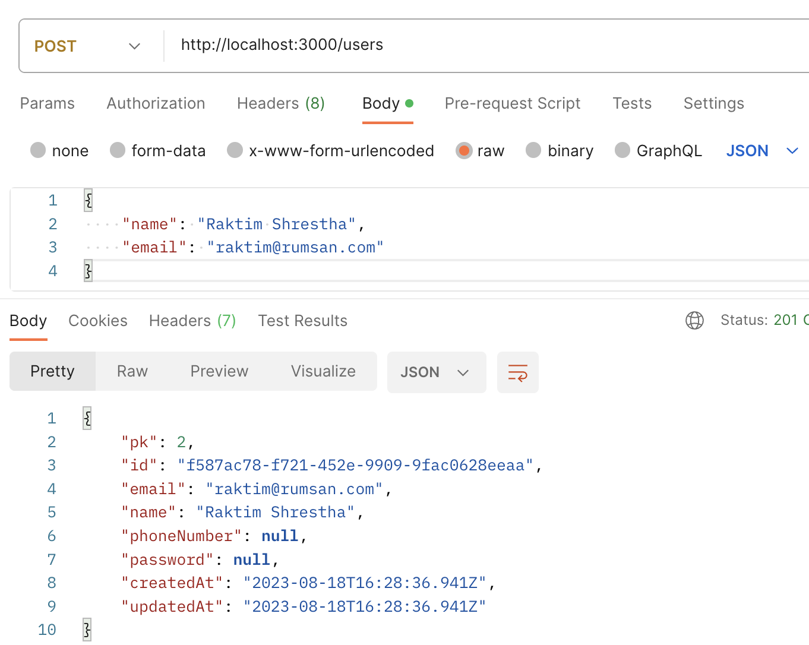
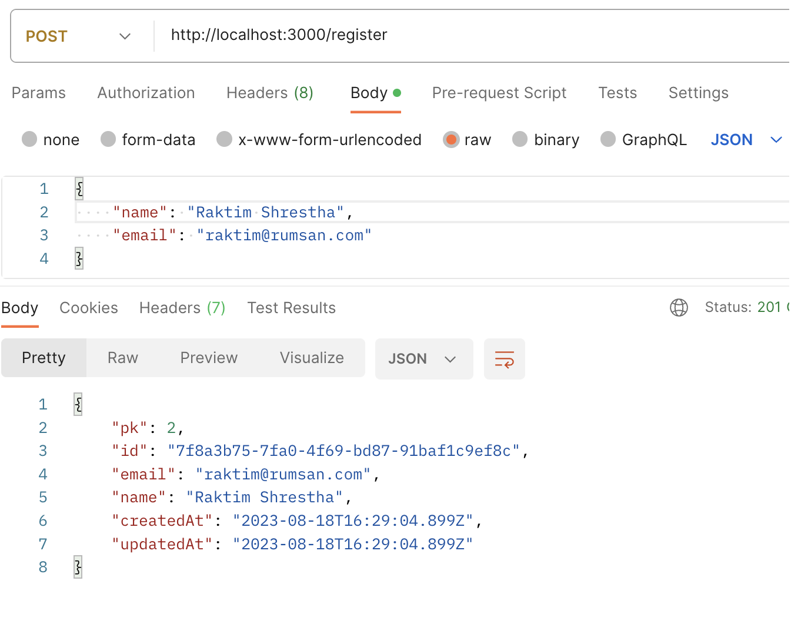

## DB Guide

In scripts field of our package.json file we added:

1. postgres:migrate:dev: this would be used to create and execute migrations on our postgres database.

2. postgres:migrate:dev:create: this would create a postgres migration file which you can edit before executing.

3. prisma: this is the prisma cli so we can run commands straight from prisma-cli.

4. postgres:migrate:deploy: this applies pending migrations to staging, testing, or production environments to your postgres database.

5. prisma:app:dbpush: this syncs the prisma/app/shema.prisma with the postgres database called app.

6. prisma:registration:dbpush: this syncs the prisma/registration/shema.prisma with the postgres database called registration.

7. prisma:generate:registration_client: this would generate the prima client for registration postgres database.

8. prisma:generate:app_client: this would generate the prisma client for app postgres database.

9. prisma:generate:db_clients: this would generate the prisma client for registration and app databases.

## Create the .env file

In terminal, run the following commands in sequence

1. `cp .env.example .env`
2. Add the DB1 and DB2 database name in .env file

## Creating DB Steps

In terminal, run the following commands in sequence

1. `yarn run postgres:migrate:registration-dev dnInit`
2. `yarn run postgres:migrate:app-dev dnInit`
3. `yarn prisma:generate:db_clients`

## Run the Application

- `yarn run start:dev`

## Test the API requests

1. Add the users in DB1

2. Add the register user in DB2

:tada: :tada: Congratulations, the guide is complete !!! :tada: :tada:
